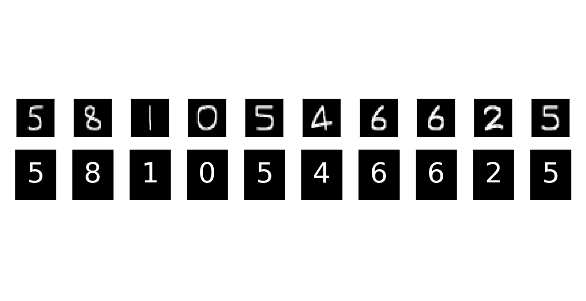

# Neural Network for Reading Student ID

A neural network for classifying digits in student ID.

## Developed by

   - Wisarut Boonnumma 5810546021
   - Chanon Jenakom 5810546625
   - Napon Kittisiriprasert 5810546684
   - Methawee Apinainarong 5810546714

## Requirements

   - Python 3.6

## Dependencies

   - OpenCV
   - matplotlib
   - NumPy
   - TensorFlow

## Tutorial

>Install the above dependencies.

>Download the data set from [here](yann.lecun/exdb/mnist/)

>Train one of the three available models (traditional neural network (sigmoid and softmax) and deep neural network (convolutional)). For example:
```sh
$ python3 train_convolutional_nn.py
```

> Run the predictions of some of the available sample images, each containing one student ID. For example:
```sh
$ python3 predict_student_id.py convolutional chanon
```

> See the prediction result!


